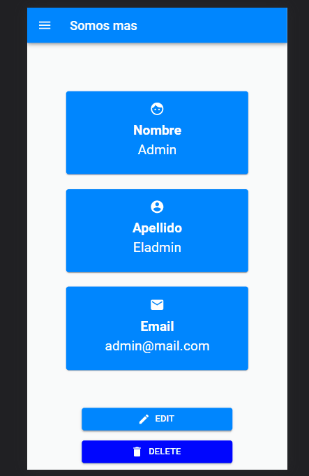

# SomosMasONG
Aplicación web destinada a la autogestión de una ONG ficticia llamada Somos Más

## ¿Que es esto?
Durante la aceleración de Alkemy, participe en el desarrollo de esta página web cuyo objetivo es el de ofrecer una solución de autosugestión de su página a la ONG, para que pueda mantener informados a sus usuarios sobre noticias y actividades, que conozcan más sobre la organización y darles la capacidad de contactarse con ellos.
También, darles la posibilidad a los administradores de tener las herramientas necesarias para gestionarla, de forma cómoda e intuitiva.

## ¿Aceleracion de Alkemy?
Podes conocer sobre la aceleración de [Alkemy](http://alkemy.org/) en su página

## Tecnologias utilizadas

### Frontend
- React
- Redux
- Material Ui
- Formik
- CKEditor
- React-router-dom
- Framer Motion

### Backend
- Express
- Sequelize
- MySql
- JsonWebToken
- Bcrypt
- Joi
- Morgan
- Winston

## Un vistaso
Podes ver el código clonando el repositorio o aquí mismo en GitHub, lamentablemente no funcionaria el servidor, hacen falta credenciales. Así que te dejo algunas imágenes/GIF del proyecto para que veas lo que fue construido durante el desarrollo.

##### Recorrido del Home

##### Recorrido del BackOffice para los usuarios administradores

##### Home desde un dispositivo Mobil

##### BackOffice desde un dispositivo Mobil

